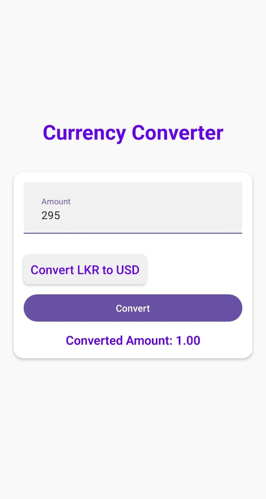

<h1>2020ICT30</h1>

<h2>This is simple currency converting app Created by using React Native</h2>
<h2>Functions : convert LKR to USD and USD to LKR</h2>

......................................................................................................................................................................................................................

Commands that are used for while creating

Project Creation: npx create-expo-app currencyapp --template blank
install react native paper: npm install react-native-paper
install react native safe area: npm install react-native-safe-area-context
start the project: npx expo start
......................................................................................................................................................................................................................
<h3>outputs</h3>

<table>
  <tr>
    <td style="border-right: 2px solid black; padding-right: 10px;">
      
    </td>
    <td style="padding-left: 10px;">
      
    </td>
  </tr>
</table>

